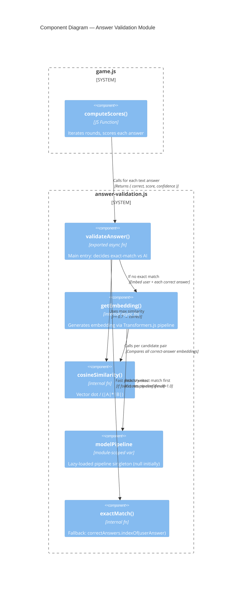

<!-- feature: ai-validation | date: 2026-05-28 | agent: design -->

# C4 Component Diagram — answer-validation.js

## Scope

Internal structure of the `answer-validation.js` module and its integration points with `game.js`.

## Diagram



## Internal Function Details

### `validateAnswer(question, userAnswer, correctAnswers) → { correct, score, confidence }`

```
1. Normalize: userAnswer.trim().toLowerCase()
2. Quick exact match against correctAnswers (indexOf)
   - If found → { correct: true, score: question.points, confidence: 1.0 }
3. If not found AND question.type === "text":
   - embeddings = await Promise.all([getEmbedding(userAnswer), ...getEmbedding(each correctAnswer)])
   - sim = max(cosineSimilarity(userEmbedding, each correctEmbedding))
   - correct = sim >= 0.7
   - confidence = sim
   - score = correct ? question.points : 0
4. Return result object
```

### `getEmbedding(text) → Float32Array`

```
1. If modelPipeline === null:
   - Import { pipeline } from "https://cdn.jsdelivr.net/npm/@xenova/transformers"
   - modelPipeline = await pipeline("feature-extraction", "Xenova/paraphrase-multilingual-MiniLM-L12-v2")
2. result = await modelPipeline(text, { pooling: "mean", normalize: true })
3. return result.data  (Float32Array, 384 dimensions)
```

### `cosineSimilarity(a, b) → number`

```
dot = 0
for i in 0..383: dot += a[i] * b[i]
return dot  // both vectors are already L2-normalized
```

## Integration with `computeScores()`

```js
// In game.js — current approach (exact match only):
const isCorrect = question.correctAnswers.indexOf(answer) !== -1;

// After change:
import { validateAnswer } from "./answer-validation.js";

async function computeScores(roomId) {
  // ... existing logic ...
  for (const question of round.questions) {
    if (question.type === "image") {
      // Keep existing exact match for image questions
      const isCorrect = question.correctAnswers.indexOf(answer) !== -1;
    } else {
      // Use AI validation for text questions
      const result = await validateAnswer(question, answer, question.correctAnswers);
      // result = { correct, score, confidence }
    }
  }
  // ... write scores to Firebase ...
}
```
