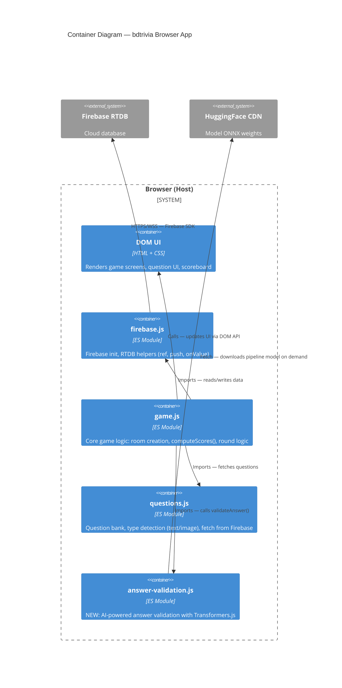

<!-- feature: ai-validation | date: 2026-05-28 | agent: design -->

# C4 Container Diagram — AI Answer Validation

## Scope

The bdtrivia browser application decomposed into ES modules. The new `answer-validation.js` module is the sole addition.

## Diagram



## Module Dependency

```
firebase.js  (Firebase init + helpers)
     ^
     |
 questions.js  (question bank, type detection)
     ^
     |
 game.js  (core game logic, computeScores())
     ^
     |
 answer-validation.js  (NEW — imported only by game.js)
```

## Existing Module Responsibilities

| Module | Responsibility |
|---|---|
| `firebase.js` | Firebase app init, RTDB ref generation, `push()`, `onValue()` listeners |
| `game.js` | Room lifecycle, `computeScores()`, round transitions, host detection |
| `questions.js` | Question pool, category filters, detect `type: "text"` vs `"image"` |

## New Module Interface

```js
// answer-validation.js — exported API
export async function validateAnswer(question, userAnswer, correctAnswers)
// Returns: { correct: boolean, score: number, confidence: number }
```
