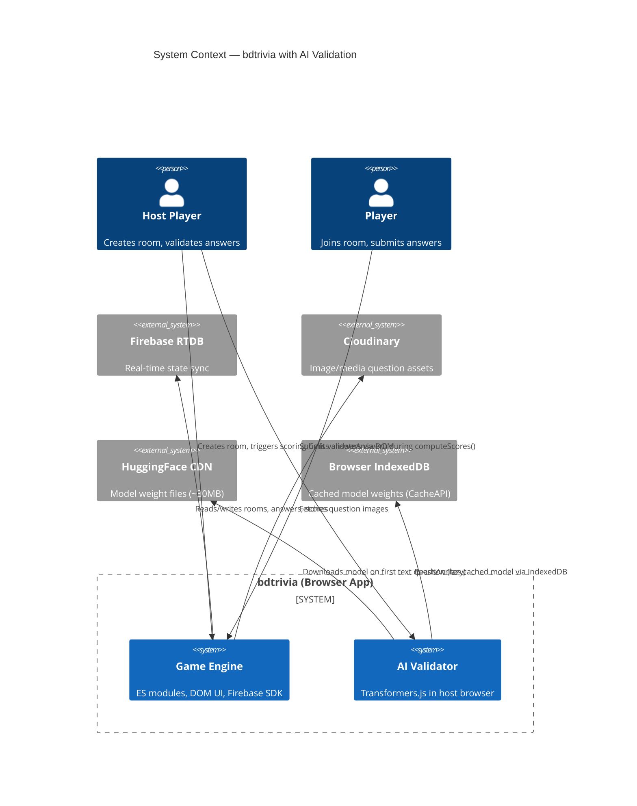

<!-- feature: ai-validation | date: 2026-05-28 | agent: design -->

# C4 Context Diagram — AI Answer Validation

## Scope

The AI Validation feature adds Transformers.js-based semantic answer matching to the bdtrivia trivia game system. It operates entirely within the host browser with no server-side component.

## Diagram

## External Systems

| System | Purpose | Interaction |
|---|---|---|
| Firebase RTDB | Room state, questions, answers, scores | Read/write via Firebase JS SDK v9+ |
| Cloudinary | Hosted images for image-round questions | Fetch via URL (unchanged) |
| HuggingFace CDN | Model ONNX weights + tokenizer files | HTTP fetch, cached in IndexedDB |
| Browser IndexedDB | CacheAPI-backed model storage | Reduces repeat downloads |

## Key Decision

The model is loaded **lazily** — only when the host's `computeScores()` encounters a text-type question for the first time, and only on the host's browser (not on non-host players). This avoids unnecessary downloads for image-only games.
