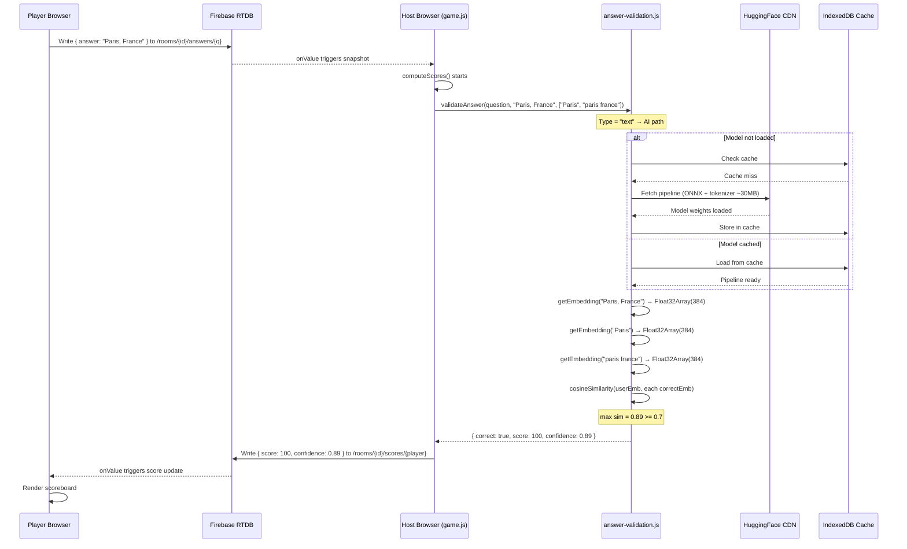

<!-- feature: ai-validation | date: 2026-05-28 | agent: design -->

# Data Flow — AI Answer Validation

## End-to-End Flow



## Data Transformations

| Step | Input | Transformation | Output |
|---|---|---|---|
| Player submit | raw text | None (stored as-is) | `string` in Firebase |
| `validateAnswer()` | userAnswer, correctAnswers[] | `.trim().toLowerCase()` | Normalized strings |
| `getEmbedding()` | normalized string | `pipeline("feature-extraction")` with mean pooling + L2 norm | `Float32Array` (384) |
| `cosineSimilarity()` | 2 Float32Arrays | `sum(a[i] * b[i])` [dot product since normalized] | `number` [0..1] |
| Threshold check | similarity score | `sim >= 0.7` | `boolean` |
| Score result | correct flag, points, confidence | Composite | `{ correct, score, confidence }` |

## Firebase Data Shape (unchanged)

```js
/rooms/{roomId}/answers/{playerId}/{questionIndex}: string
/rooms/{roomId}/scores/{playerId}/{questionIndex}: {
  score: number,
  confidence: number    // NEW field
}
```

The only change is the addition of a `confidence` field alongside `score` in the scores node, enabling the host UI to show a confidence indicator for AI-validated answers.
