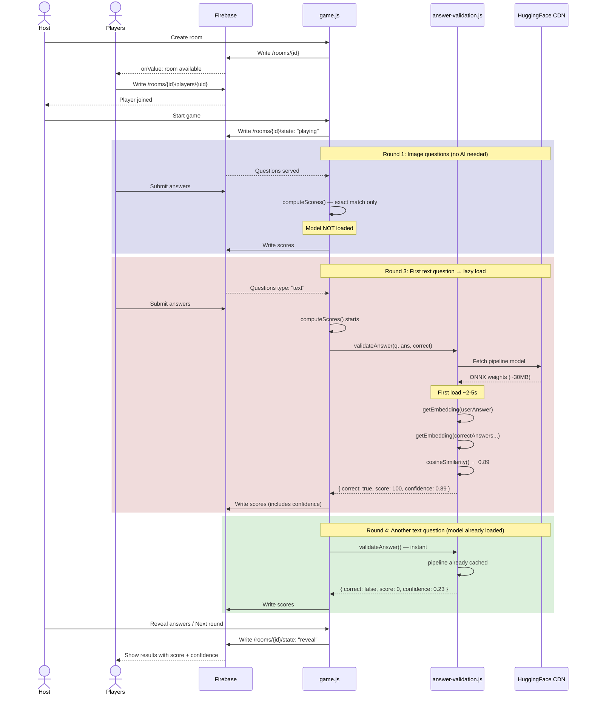
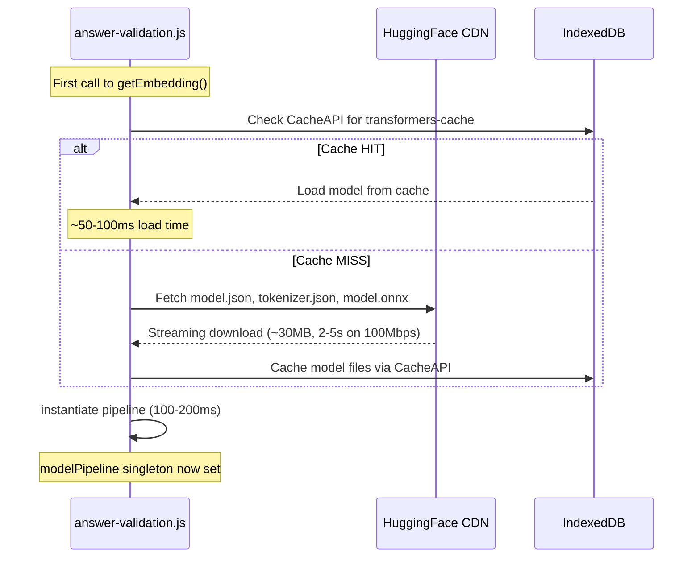

<!-- feature: ai-validation | date: 2026-05-28 | agent: design -->

# Sequence Diagram — AI Validation Lifecycle

## Full Game Lifecycle

```mermaid
sequenceDiagram
    actor H as Host
    actor P as Players
    participant FB as Firebase
    participant G as game.js
    participant AV as answer-validation.js
    participant HF as HuggingFace CDN

    H->>G: Create room
    G->>FB: Write /rooms/{id}
    FB-->>P: onValue: room available
    P->>FB: Write /rooms/{id}/players/{uid}
    FB-->>H: Player joined

    H->>G: Start game
    G->>FB: Write /rooms/{id}/state: "playing"

    rect rgb(220, 220, 240)
        Note over G,HF: Round 1: Image questions (no AI needed)
        FB-->>G: Questions served
        P->>FB: Submit answers
        G->>G: computeScores() — exact match only
        Note over G: Model NOT loaded
        G->>FB: Write scores
    end

    rect rgb(240, 220, 220)
        Note over G,HF: Round 3: First text question → lazy load
        FB-->>G: Questions type: "text"
        P->>FB: Submit answers
        G->>G: computeScores() starts
        G->>AV: validateAnswer(q, ans, correct)
        AV->>HF: Fetch pipeline model
        HF-->>AV: ONNX weights (~30MB)
        Note over AV: First load ~2-5s
        AV->>AV: getEmbedding(userAnswer)
        AV->>AV: getEmbedding(correctAnswers...)
        AV->>AV: cosineSimilarity() → 0.89
        AV-->>G: { correct: true, score: 100, confidence: 0.89 }
        G->>FB: Write scores (includes confidence)
    end

    rect rgb(220, 240, 220)
        Note over G,HF: Round 4: Another text question (model already loaded)
        G->>AV: validateAnswer() — instant
        AV->>AV: pipeline already cached
        AV-->>G: { correct: false, score: 0, confidence: 0.23 }
        G->>FB: Write scores
    end

    H->>G: Reveal answers / Next round
    G->>FB: Write /rooms/{id}/state: "reveal"
    FB-->>P: Show results with score + confidence
```

## Lazy Load Detail

```mermaid
sequenceDiagram
    participant AV as answer-validation.js
    participant HF as HuggingFace CDN
    participant IDB as IndexedDB

    Note over AV: First call to getEmbedding()
    AV->>IDB: Check CacheAPI for transformers-cache
    alt Cache HIT
        IDB-->>AV: Load model from cache
        Note over AV: ~50-100ms load time
    else Cache MISS
        AV->>HF: Fetch model.json, tokenizer.json, model.onnx
        HF-->>AV: Streaming download (~30MB, 2-5s on 100Mbps)
        AV->>IDB: Cache model files via CacheAPI
    end
    AV->>AV: instantiate pipeline (100-200ms)
    Note over AV: modelPipeline singleton now set
```
