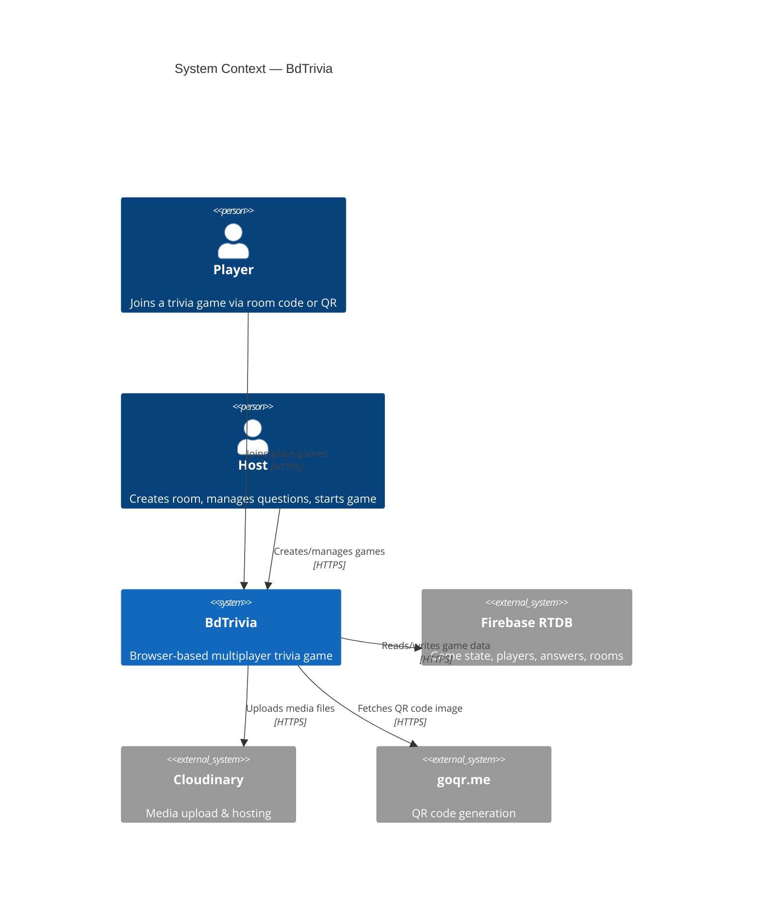
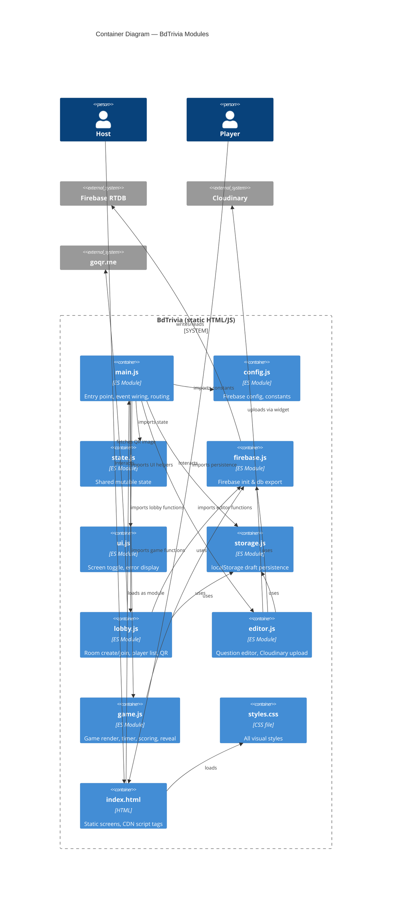

<!-- feature: js-refactor | phase: design | date: 2026-05-28 | agent: design-lead -->

# Architecture: JS Refactor to ES Modules

## Current Architecture (Monolith)

```
index.html (1441 lines)
├── <head>
│   ├── <style> (lines 10-140) — 105 CSS rules inline
│   └── CDN scripts (Firebase, Cloudinary) — lines 7-9
└── <body>
    ├── HTML screens (8 screens, lines 141-229)
    └── <script> (lines 231-1439) — all JS inline
```

## Target Architecture (Modular)

```
index.html (~100 lines)
├── <head>
│   ├── <link rel="stylesheet" href="css/styles.css">
│   └── CDN scripts (Firebase, Cloudinary)
└── <body>
    ├── HTML screens (8 screens)
    └── <script type="module" src="js/main.js"> (entry point)

js/
├── main.js          — Entry point: imports all modules, wires event listeners, initial routing
├── config.js        — Firebase config, constants (ROOM_CODE_LENGTH, CHARSET)
├── state.js         — Mutable shared state object
├── firebase.js      — Firebase init, exports db
├── ui.js            — Screen management, error display, escapeHtml
├── storage.js       — localStorage draft persistence
├── lobby.js         — Room creation, player join, QR, player list
├── editor.js        — Question editor CRUD, Cloudinary upload
├── game.js          — Game rendering, timer, scoring, reveal, answers

css/
└── styles.css       — All styles (exact copy of current inline, already exists)
```

## C4 Context Diagram



## C4 Container Diagram



## Dependency Direction

```
index.html → main.js
               ├── config.js   (constants only, no deps)
               ├── state.js    (no deps)
               ├── firebase.js → config.js
               ├── ui.js       (no deps)
               ├── storage.js  (depends on state.js)
               ├── lobby.js    → firebase.js, state.js, ui.js, storage.js
               ├── editor.js   → state.js, ui.js, storage.js, firebase.js, config.js
               └── game.js     → firebase.js, state.js, ui.js, config.js
```

All dependencies flow inward. No circular dependencies. `config.js` and `state.js` have zero dependencies.

## What Exists vs What is New

- **`css/styles.css`** — EXISTS (orphaned, exact copy of inline CSS). Only needs `<link>` tag.
- **`js/config.js`** — EXISTS (needs minor review)
- **`js/state.js`** — EXISTS (needs minor review)
- **`js/firebase.js`** — EXISTS (needs minor review)
- **`js/ui.js`** — EXISTS (needs minor review)
- **`js/storage.js`** — EXISTS (needs minor review)
- **`js/editor.js`** — EXISTS (needs review — may differ from inline version)
- **`js/lobby.js`** — EXISTS (needs review — may differ from inline version)
- **`js/game.js`** — EXISTS (needs review — may differ from inline version)
- **`js/main.js`** — NEW (entry point to wire everything)
- **`index.html`** — MODIFIED (remove inline CSS/JS, add `<link>` and `<script type="module">`)

## Standards Conformance

- [x] ES modules (`type="module"`) — automatic `defer`, cleaner imports/exports
- [x] No build step — static files served directly from GitHub Pages
- [x] Module names match file names
- [x] Each module has a single responsibility
- [x] No circular dependencies
- [x] All global state centralized in `state.js`
- [x] Firebase compat SDK kept as CDN script (not imported as module)
- [x] Cloudinary widget kept as CDN script (not imported as module)
