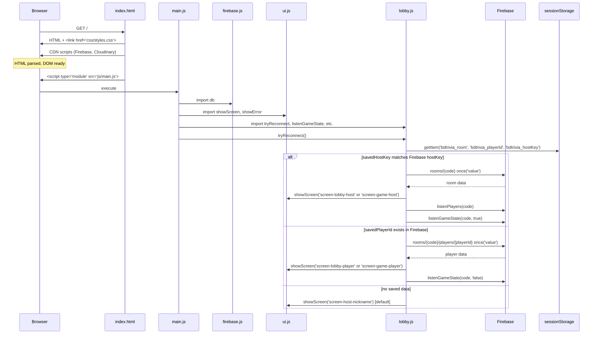
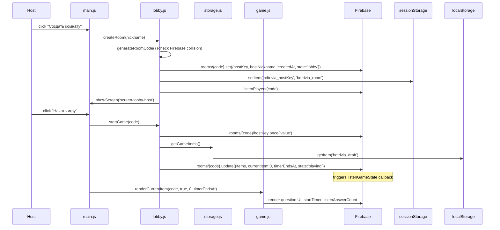
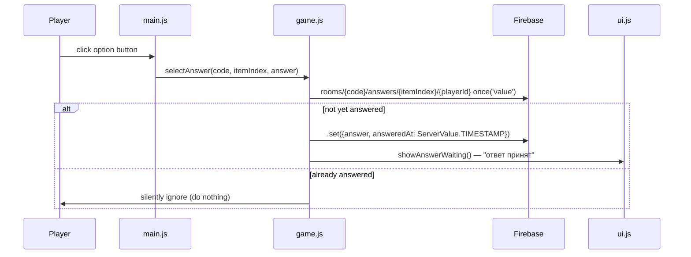
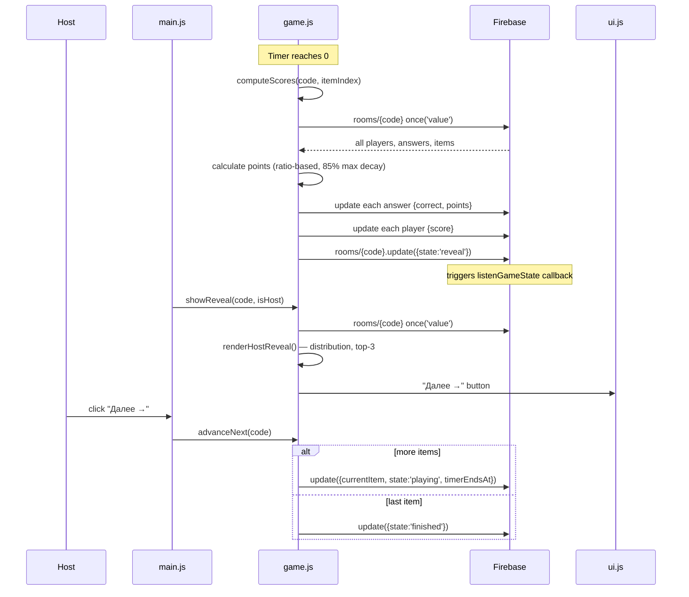
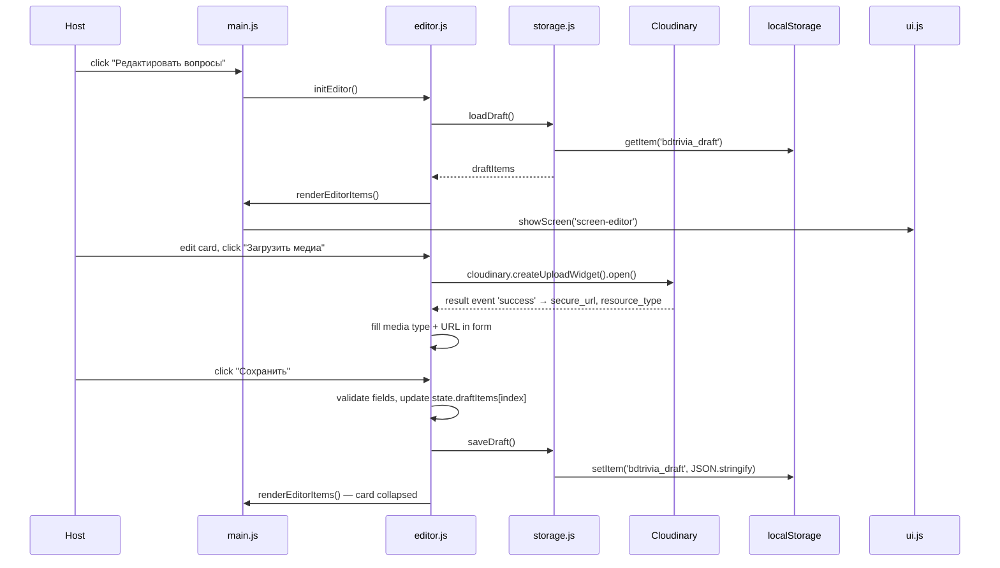

<!-- feature: js-refactor | phase: design | date: 2026-05-28 | agent: design-lead -->

# Sequence Diagrams: JS Refactor

## Page Load and Reconnect

## Host Creates Room & Starts Game

## Player Answers Question

## Timer Expiry → Scoring → Reveal → Next

## Question Editor — Save Item

