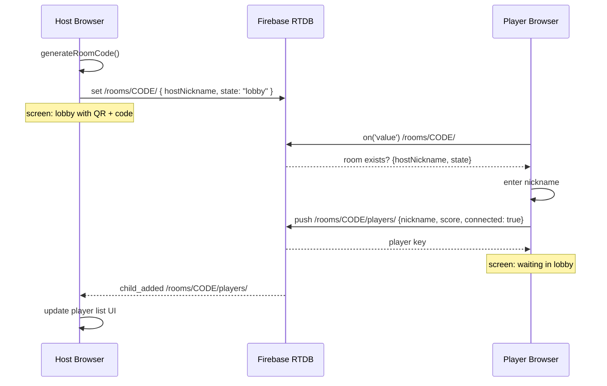

<!-- feature: p1-1-room-firebase | phase: design | date: 2026-05-27 | agent: design-lead -->

# P1.1 — Room + Firebase: Design

## Overview

Create the foundational HTML page with Firebase integration, room code generation, and room creation. This is the backbone that all subsequent features build on.

## Architecture

### Mode Detection

```
index.html                    → Host mode
index.html?room=XXXX          → Player mode (auto-join)
```

### Screen Architecture (SPA-style)

All screens are `<div>` elements inside a single `<div id="app">`. Screens are shown/hidden via a `showScreen(id)` function.

**P1.1 Screens:**
- `screen-host-nickname` — host enters their name
- `screen-lobby` — room code + player list (host view) / waiting (player view)
- `screen-player-roomcode` — player enters room code (fallback if not in URL)
- `screen-player-nickname` — player enters their name

### Firebase Integration

- SDK: compat (firebase-app-compat + firebase-database-compat) loaded via CDN
- RTDB structure: `/rooms/<code>/hostNickname`, `/rooms/<code>/createdAt`, `/rooms/<code>/state`, `/rooms/<code>/players/`

### Room Code Generation

```
CHARSET = 'ABCDEFGHJKMNPQRSTUVWXYZ23456789'  (excludes 0/O/1/I/L)
generateRoomCode(length=4) → random 4-char string
checkUniqueness(code) → verify /rooms/<code>/ doesn't exist
```

4 chars → 29^4 = 707,281 combinations. If collision, regenerate.

### Data Flow

```
Host: enter nickname → click "Create Room" 
  → generateRoomCode() → set /rooms/<code>/{ hostNickname, createdAt, state: "lobby", players: {} }
  → show lobby screen with room code

Player: ?room=CODE or enter code → enter nickname → click "Join"
  → push to /rooms/<code>/players/<pushId>/{ nickname, score: 0, connected: true }
  → subscribe to /rooms/<code>/players/ → show lobby
```

## Mermaid Diagram



## Risks

| Risk | Severity | Mitigation |
|---|---|---|
| Room code collision | Low | Check exists in Firebase before write; regenerate |
| Firebase connection fail | Medium | Show error message; retry button |
| Player rejoin after disconnect | Medium | Store playerId in sessionStorage; reconnect with same ID |
